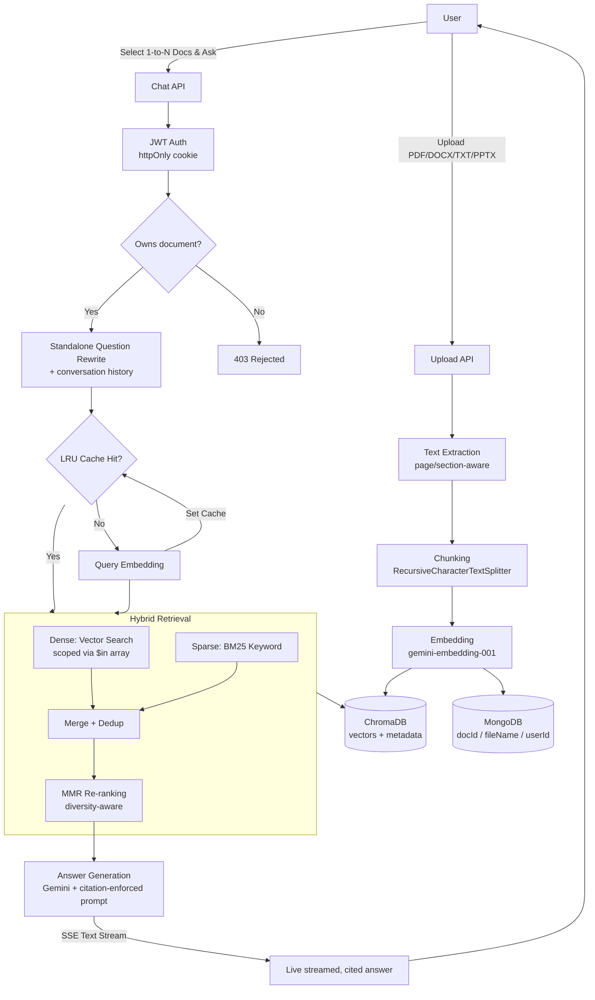

# RAGify AI

A production-grade Retrieval-Augmented Generation (RAG) application that lets users upload documents (PDF, DOCX, TXT, PPTX) and ask natural-language questions, answered strictly from that content, with inline citations back to the exact source file and section.

This isn't a weekend RAG demo — it's a system that was iteratively stress-tested against real failure modes (retrieval duplication, false-premise questions, tone-vs-accuracy conflation, rate-limit exhaustion), featuring **real-time SSE streaming, cross-document context pooling, and an automated regression harness.**

---

## Architecture



**Request flow, in short:** A question is rewritten into a clean standalone query (aware of prior chat turns). The system checks an **in-memory LRU cache** to prevent redundant API embedding costs. The query is then searched two ways at once across the user's selected document array — dense vector similarity and sparse BM25 keyword matching. Results are merged, deduplicated, and re-ranked with Maximal Marginal Relevance before being handed to the LLM, which streams its answer back to the client via **Server-Sent Events (SSE)**, citing every claim back to its source file and section.

---

## Tech Stack

| Layer | Technology |
|---|---|
| Backend | Node.js, Express |
| Frontend | React, Vite, Tailwind CSS |
| Vector Store | ChromaDB (self-hosted, Docker) |
| Metadata / Auth DB | MongoDB |
| Embeddings | Gemini (`gemini-embedding-001`) |
| Chat Generation | Gemini (`gemini-3.5-flash` / `gemini-3.5-flash-lite`) |
| Streaming | Server-Sent Events (SSE) |
| Caching | `lru-cache` (Deterministic query caching) |
| Auth | JWT via httpOnly cookies |
| Retrieval | Hybrid: dense vector search + BM25 + MMR re-ranking |

---

## Key Features

- **Multi-Document Cross-RAG** — users can select multiple documents simultaneously; the backend dynamically pools context using ChromaDB's `$in` array filtering across isolated vector spaces.
- **Real-Time Streaming (SSE)** — token-by-token generation streamed natively to the frontend, eliminating long blocking request times for complex queries.
- **Automated Evaluation Harness** — a programmatic regression script (`backend/evalHarness.js`) that tests the live API against 10 strict edge cases (factual recall, false-premise rejections, off-topic boundaries).
- **LRU Embedding Caching** — normalizes and caches frequent user queries in-memory to slash API latency and embedding costs.
- **Multi-format ingestion** — PDF (page-level), DOCX (heading-aware via Mammoth), PPTX (slide-level), TXT.
- **Hybrid retrieval** — combines semantic (vector) and keyword (BM25) search, merged and re-ranked with MMR to eliminate duplicate/redundant results.
- **Adaptive retrieval depth** — the number of chunks retrieved scales dynamically with the combined size of the selected documents.
- **Grounded, cited answers** — every claim is tied to a specific source file and section; the model explicitly flags what it cannot answer rather than guessing.
- **Tone-aware, fact-stable generation** — emotionally-worded questions get a warmer response tone without that emotion affecting what gets retrieved or stated as fact.
- **Per-user document isolation** — enforced at both the database layer (MongoDB ownership checks) and the vector store layer (Chroma metadata filtering).
- **Rate-limit resilient ingestion** — a proactive sliding-window limiter paces embedding requests against Gemini's actual RPM/TPM budget, with automatic backoff using the API's own suggested retry delay.

---

## Key Design Decisions & Trade-offs

**Server-Sent Events (SSE) over WebSockets.** For unidirectional text generation from an LLM, WebSockets introduce unnecessary bi-directional overhead and state management. SSE utilizes standard HTTP infrastructure, making it lighter and easier to proxy while delivering real-time tokens seamlessly.

**Deterministic LRU Caching.** Re-vectorizing identical queries wastes API quota. An in-memory LRU cache normalizes queries (`toLowerCase().trim()`) before embedding, serving frequent queries instantly with zero API cost, bounded by a strict TTL and max-item count to prevent memory leaks.

**Automated Regression Harness over Manual QA.** RAG systems are prone to regressions when tweaking retrieval logic. `evalHarness.js` replaced manual UI testing, programmatically verifying that false-premises are rejected and tabular extraction succeeds across code iterations.

**Hybrid search over pure vector search.** Pure vector search reliably missed exact-term matches and returned near-duplicate chunks instead of diverse ones. Adding BM25 keyword search and MMR re-ranking fixed this — validated by a controlled test where a duplicate-heavy document went from 17/18 near-identical retrieved chunks to 18/18 distinct ones, with zero measurable latency cost.

**Adaptive top-K instead of a fixed retrieval depth.** A fixed `topK` works for narrow factual questions but fails broad "summarize everything" questions once a document grows past a small chunk count. Top-K now scales based on the chunk count tracked in MongoDB.

**Two-signal prompt separation for tone vs. retrieval.** Early versions reused the same sanitized question for both embedding/retrieval and final answer generation, which stripped emotionally meaningful context. Fixed by passing the original message separately, explicitly for tone only.

**Proactive rate-limit pacing over reactive retry-only.** Retry-after-failure alone proved insufficient for 100+ page documents. A sliding-window limiter that tracks cumulative token usage and paces requests *before* hitting the ceiling replaced blind retry logic.

---

## Validation

Retrieval quality and groundedness are continuously verified via the automated `evalHarness.js` script against a battery of query types, not just happy-path examples:

| Query type | What it validates |
|---|---|
| Narrow factual | Precise retrieval, minimal distractor influence |
| Broad/summary | Adaptive top-K coverage across a whole document |
| False premise (technical) | Correction of incorrect assumptions rather than agreement |
| Comparison | Structured (table) output on request |
| Extraction | Terse, no-filler answers for direct questions |
| Emotional + factual | Tone adaptation without fact distortion |
| Numeric/enumeration | Exact counts, correct source discrimination against look-alike distractors |
| Off-topic | Honest "not found" rather than fabrication |

*Every test case above passes with citations traceable to real, verifiable source text — not just plausible-sounding output.*

**Live Evaluation Results:**

```text
=== RAGify AI Evaluation Harness ===

Logging in...
Resolving docId for "Web Development (IT report) .docx"...
Found docId: be80cd13-1050-48db-8d1f-6f9e7e427635 (56 chunks)

#1 [Narrow factual] ... PASS  (2331ms, 8 sources)
#2 [Broad / summary] ... PASS  (3516ms, 8 sources)
#3 [False premise (technical)] ... PASS  (2011ms, 8 sources)
#4 [Comparison / table] ... PASS  (2233ms, 8 sources)
#5 [Extraction (terse)] ... PASS  (1865ms, 8 sources)
#6 [Emotional + factual] ... PASS  (2391ms, 8 sources)
#7 [Numeric / enumeration] ... PASS  (2118ms, 8 sources)
#8 [Off-topic (should refuse)] ... PASS  (1276ms, 8 sources)
#9 [Analogy / conceptual] ... PASS  (1596ms, 8 sources)
#10 [Standard Concept Verification] ... PASS  (1957ms, 8 sources)

=== Summary: 10/10 passed ===

┌─────────┬────┬─────────────────────────────────┬────────┬───────────┐
│ (index) │ #  │ Category                        │ Result │ Time (ms) │
├─────────┼────┼─────────────────────────────────┼────────┼───────────┤
│ 0       │ 1  │ 'Narrow factual'                │ 'PASS' │ 2331      │
│ 1       │ 2  │ 'Broad / summary'               │ 'PASS' │ 3516      │
│ 2       │ 3  │ 'False premise (technical)'     │ 'PASS' │ 2011      │
│ 3       │ 4  │ 'Comparison / table'            │ 'PASS' │ 2233      │
│ 4       │ 5  │ 'Extraction (terse)'            │ 'PASS' │ 1865      │
│ 5       │ 6  │ 'Emotional + factual'           │ 'PASS' │ 2391      │
│ 6       │ 7  │ 'Numeric / enumeration'         │ 'PASS' │ 2118      │
│ 7       │ 8  │ 'Off-topic (should refuse)'     │ 'PASS' │ 1276      │
│ 8       │ 9  │ 'Analogy / conceptual'          │ 'PASS' │ 1596      │
│ 9       │ 10 │ 'Standard Concept Verification' │ 'PASS' │ 1957      │
└─────────┴────┴─────────────────────────────────┴────────┴───────────┘
```
---

## Known Limitations

Documented honestly rather than left as unstated gaps:

- **Chunking is not table-aware** — tabular content in source documents is currently flattened. In DOCX, the HTML-stripping regex destroys `<table>` structure; in PDFs, Y-coordinate merging smashes columns together. A future fix requires translating these structural tags into Markdown grids prior to embedding.
- **Deduplication doesn't scale past demo-corpus size** — the near-duplicate filter is $O(n^2)$; a large candidate pool would need an approximate/LSH-based approach instead.
- **Free-tier API quotas are a real, hit constraint** — embedding and chat generation have both been rate-limited during heavy testing; a production deployment would need a paid tier.
- **No rate-limit/cost visibility in the UI** — the system tracks and paces against real quota data internally, but doesn't yet surface it to the user.

---

## Setup

```bash
# Backend
cd Backend
npm install
cp .env.example .env   # fill in MONGO_URI, GEMINI_API_KEY, JWT_SECRET
npm run dev

# Run Automated Test Harness (while backend is running)
npm run eval

# ChromaDB (Docker)
docker run -d -p 8000:8000 -v ./chroma_data:/data --name ChromaDB chromadb/chroma

# Frontend
cd Frontend
npm install
cp .env.example .env   # set VITE_API_BASE_URL
npm run dev
```